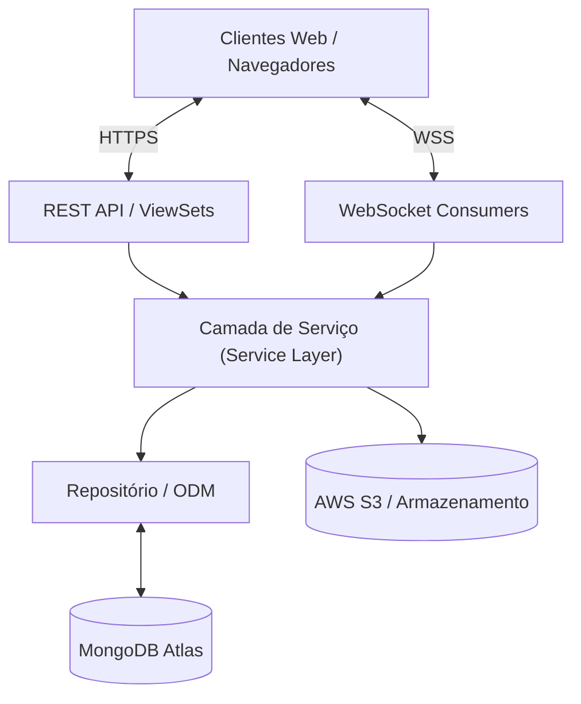

# Cardápio Online

[](https://www.python.org/)
[](https://www.djangoproject.com/)
[](https://www.mongodb.com/)
[](https://channels.readthedocs.io/)
[](LICENSE)

Uma plataforma SaaS de alta performance e multi-tenant desenvolvida para gestão de cardápios digitais e processamento de pedidos em tempo real. Construída com Django, MongoDB e WebSocket, ela permite que restaurantes criem cardápios digitais dinâmicos, gerenciem pedidos instantaneamente e ofereçam uma experiência premium e sem fricções para os clientes finais.

---

## Sumário

- [Visão Geral do Sistema](#visão-geral-do-sistema)
- [Principais Funcionalidades](#principais-funcionalidades)
- [Stack Tecnológica](#stack-tecnológica)
- [Arquitetura](#arquitetura)
- [Setup de Desenvolvimento](#setup-de-desenvolvimento)
- [Variáveis de Ambiente](#variáveis-de-ambiente)
- [Estrutura de Diretórios](#estrutura-de-diretórios)
- [Documentação da API](#documentação-da-api)
- [Segurança](#segurança)
- [Roadmap](#roadmap)
- [Licença](#licença)

---

## Visão Geral do Sistema

O Cardápio Online é uma solução *enterprise-grade* construída para eliminar a dependência de marketplaces terceirizados de delivery. O sistema empodera donos de restaurantes com total autonomia sobre sua presença digital, garantindo ao mesmo tempo uma infraestrutura escalável, tolerante a falhas e de alta disponibilidade, capaz de lidar com milhares de conexões simultâneas em tempo real.

---

## Principais Funcionalidades

### Para Donos de Restaurantes (Tenants)
- **Dashboard em Tempo Real:** Acompanhamento e transição de status de pedidos instantaneamente, impulsionado por WebSocket.
- **Gestão de Catálogo:** Catálogo de produtos de alta performance com suporte a múltiplas imagens, categorias dinâmicas e controle de disponibilidade.
- **Análises e Relatórios:** Acompanhamento de vendas, faturamento diário/semanal/mensal e ticket médio calculados via *Aggregation Pipelines* do MongoDB.
- **Customização:** Configurações específicas por inquilino, incluindo taxas de entrega, tempo estimado e identidade visual.

### Para Clientes
- **Busca Global:** Descoberta de produtos em todos os restaurantes cadastrados na plataforma.
- **Carrinho Multi-Restaurante:** Carrinho intuitivo que suporta itens de diferentes locais.
- **Acompanhamento ao Vivo:** Atualização do status do pedido em tempo real (Pendente, Preparando, Pronto) via WebSocket.
- **Gestão de Endereços:** Múltiplos perfis de entrega com preenchimento automático via CEP.
- **Motor de Promoções:** Validação inteligente de cupons com suporte a valores fixos, porcentagens e regras de expiração.

---

## Stack Tecnológica

### Backend & Core
- **Linguagem e Framework:** Python 3.12, Django 5.0, Django REST Framework 3.15
- **Banco de Dados:** MongoDB Atlas (via MongoEngine) para manipulação de dados escalável e *schema-less*.
- **Motor Real-Time:** Django Channels 4.0, Daphne, Redis, WebSocket.
- **Segurança:** Autenticação Stateless via JWT, hashing com bcrypt, proteção contra *Timing Attacks*.
- **Padrões:** Clean Architecture, Repository Pattern, Services Pattern, Domain Exceptions, Injeção de Dependências.

### Frontend
- **Interface:** HTML5, Jinja2, Tailwind CSS.
- **Ícones:** Lucide Icons.
- **JavaScript:** ES Modules para Gerenciamento de Carrinho, Autenticação, Integração de API e ViaCEP.

---

## Arquitetura

O sistema segue o rigoroso padrão *Layered Clean Architecture* para desacoplar as regras de negócio das camadas de apresentação e acesso a dados.



---

## Setup de Desenvolvimento

O projeto foi estruturado para ser executado localmente de forma simples, sem Docker, garantindo um ambiente de desenvolvimento direto.

### Pré-requisitos
- Python 3.12+
- Instância do MongoDB (Local ou Atlas)
- Instância do Redis (Opcional para desenvolvimento, obrigatório para produção)

### Passos de Instalação

1. **Clone o repositório:**
   ```bash
   git clone https://github.com/fabioargel/cardapio-online.git
   cd cardapio-online
   ```

2. **Crie e ative o ambiente virtual:**
   ```bash
   python -m venv venv

   # Windows
   .\venv\Scripts\activate

   # Linux / macOS
   source venv/bin/activate
   ```

3. **Instale as dependências:**
   ```bash
   pip install -r requirements.txt
   ```

4. **Configure as Variáveis de Ambiente:**
   ```bash
   cp .env.example .env
   ```
   *Nota: Certifique-se de definir a `MONGODB_URI` corretamente no arquivo `.env`.*

5. **Execute a Aplicação:**
   ```bash
   cd app
   python manage.py runserver
   ```
   Acesse o frontend em: `http://localhost:8000`

---

## Variáveis de Ambiente

| Variável | Descrição | Padrão |
|----------|-------------|---------|
| `SECRET_KEY` | Chave criptográfica do Django | - |
| `DEBUG` | Ativar/Desativar modo de depuração | `True` |
| `ALLOWED_HOSTS` | Hostnames permitidos para o servidor | `localhost, 127.0.0.1` |
| `MONGODB_URI` | String de Conexão do MongoDB | `mongodb://localhost:27017/cardapio` |
| `AWS_ACCESS_KEY` | Credenciais de armazenamento S3 | - |

---

## Estrutura de Diretórios

```text
cardapio-online/
├── app/
│   ├── app/settings/          # Módulos de configuração (base, dev, prod)
│   ├── apps/
│   │   ├── authentication/    # Usuários, JWT, Endereços, OAuth
│   │   ├── core/              # Interfaces, Utils, Exceptions, Middlewares
│   │   ├── orders/            # Pedidos, Carrinho, Cupons, WebSockets
│   │   ├── restaurants/       # Locatários (Tenants), Produtos, Aggregation Pipelines
│   │   └── reviews/           # Sistema de avaliações
│   ├── static/                # Módulos JS, CSS, Assets
│   ├── templates/             # Templates baseados em componentes Jinja2
├── requirements.txt           # Dependências Python
└── docs/                      # Documentação Técnica
```

---

## Documentação da API

A plataforma fornece documentação de API interativa em conformidade com os padrões OpenAPI/Swagger.

Com o servidor rodando, acesse a documentação em:
**`http://localhost:8000/api/docs/`**

### Módulos da API:
- `/api/auth/` - Autenticação JWT e integração OAuth.
- `/api/restaurants/` - Gestão de restaurantes (Tenants), catálogos de produtos e estatísticas.
- `/api/orders/` - Realização de pedidos, rastreamento em tempo real e validação de cupons.
- `/api/reviews/` - Endpoint para feedback e avaliações.

---

## Segurança

O Cardápio Online foi desenvolvido com os padrões de segurança da indústria corporativa:
- **Isolamento de Tenants:** Isolamento de dados entre locatários aplicado na camada de repositório.
- **Autenticação:** JWT Stateless com tokens de atualização (refresh tokens) rotativos e OAuth 2.0.
- **Integridade de Dados:** Proteção nativa contra injeções NoSQL (NoSQL Injection) e vulnerabilidades XSS.
- **Cabeçalhos Seguros:** Implementação rigorosa de `X-Content-Type-Options`, `X-Frame-Options` e `X-XSS-Protection`.

---

## Roadmap

- **Fase 1:** Funcionalidades principais, painel em tempo real, integrações de pagamento.
- **Fase 2:** Análises avançadas, upselling inteligente, recomendações de produtos baseadas em IA.
- **Fase 3:** Aplicativos móveis nativos (React Native) para clientes finais e rastreamento de entregadores.

---

## Licença

Este projeto é licenciado sob a Licença MIT.
