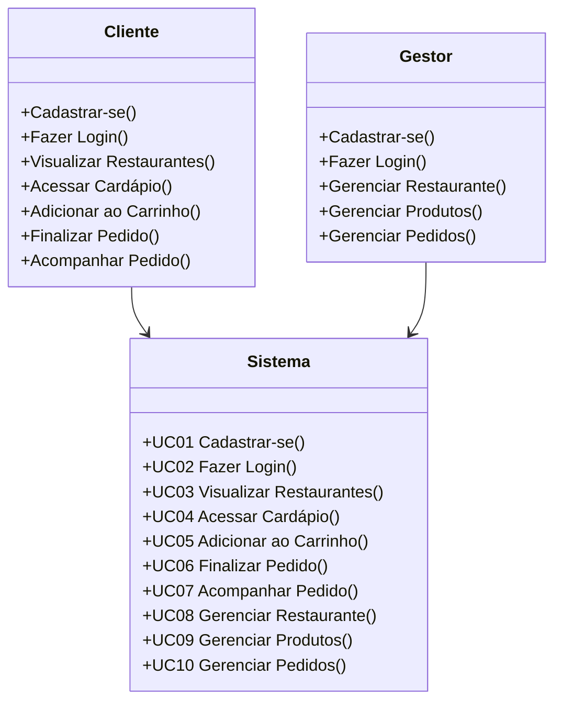

# 3. Casos de Uso

Este documento detalha as interações comportamentais entre os atores (usuários) e o sistema Cardápio Online, descrevendo os fluxos principais e alternativos da plataforma.

---

## Sumário

- [3.1 Diagrama de Casos de Uso](#31-diagrama-de-casos-de-uso)
- [3.2 Detalhamento dos Casos de Uso](#32-detalhamento-dos-casos-de-uso)

---

## 3.1 Diagrama de Casos de Uso

O diagrama abaixo mapeia as macrofuncionalidades expostas pelo sistema e os atores com permissão para executá-las.

---

## 3.2 Detalhamento dos Casos de Uso

### UC01 — Cadastrar-se na Plataforma

| Propriedade | Descrição |
| --- | --- |
| **Ator Primário** | Cliente / Gestor |
| **Pré-condição** | Usuário não autenticado e não cadastrado previamente. |
| **Pós-condição** | Identidade do usuário criada no banco de dados e sessão inicializada com emissão de token JWT. |

**Fluxo Principal:**
1. O usuário acessa a página de registro do sistema.
2. O sistema exibe o formulário solicitando tipo de perfil (`customer` ou `owner`).
3. O usuário preenche as credenciais padrão (nome, e-mail, senha) ou seleciona a integração OAuth 2.0 (Google).
4. O sistema processa a sanitização e validação das entradas (unicidade de e-mail e políticas de senha forte).
5. O sistema persiste a entidade, gera o payload JWT e devolve os tokens.
6. O usuário é redirecionado de acordo com a sua *role* específica.

**Fluxos de Exceção:**
* *Conflito de Identidade:* Caso o e-mail exista, o processo é abortado com a emissão do status HTTP 409 Conflict e aviso em interface.
* *Validação Falha:* Dados inconsistentes geram feedback inline nos campos do formulário (HTTP 400 Bad Request).

---

### UC02 — Fazer Login

| Propriedade | Descrição |
| --- | --- |
| **Ator Primário** | Cliente / Gestor |
| **Pré-condição** | Identidade de usuário previamente registrada e não revogada. |
| **Pós-condição** | Sessão ativa e cliente munido do token de autorização. |

**Fluxo Principal:**
1. O usuário submete suas credenciais na página de login ou clica na autenticação integrada.
2. O serviço de autenticação resolve o hash criptográfico ou valida a assinatura do token do provedor (OAuth).
3. Após confirmação, um par de JWT (Access e Refresh) é emitido.
4. O frontend armazena os tokens de forma segura e injeta os headers nas próximas requisições.
5. O fluxo termina no dashboard correspondente ao tipo de usuário.

**Fluxos de Exceção:**
* *Falha de Credencial:* Retorno genérico de segurança, sem indicar se a falha foi no e-mail ou na senha.
* *Account Lockout:* Bloqueio protetivo temporário mediante múltiplas tentativas frustradas.

---

### UC03 — Visualizar Ecossistema de Restaurantes

| Propriedade | Descrição |
| --- | --- |
| **Ator Primário** | Cliente |
| **Pré-condição** | O cliente possui acesso público à internet (requisição não autenticada). |
| **Pós-condição** | Lista segmentada de estabelecimentos visível e paginada. |

**Fluxo Principal:**
1. O cliente visita a interface pública de descoberta (Home).
2. O sistema constrói e despacha a query com otimização no MongoDB, buscando tenants ativos.
3. A interface apresenta a grid de estabelecimentos utilizando técnica de Lazy Loading para os assets (S3).
4. O cliente utiliza o motor de busca ou filtros semânticos para refinar a apresentação.

---

### UC04 — Acessar Cardápio Detalhado

| Propriedade | Descrição |
| --- | --- |
| **Ator Primário** | Cliente |
| **Pré-condição** | Seleção de um restaurante válido listado. |
| **Pós-condição** | Renderização completa dos produtos, organizados por taxonomia. |

**Fluxo Principal:**
1. O cliente aciona o hiperlink (slug ou ID) de um restaurante específico.
2. A aplicação resolve os metadados do restaurante juntamente com seu array de produtos.
3. Os produtos são hierarquizados dinamicamente através de abas de categorias.
4. O usuário interage com o modal de detalhes para visualizar descrições complexas e precificação de cada item.

---

### UC05 — Gestão Assíncrona do Carrinho de Compras

| Propriedade | Descrição |
| --- | --- |
| **Ator Primário** | Cliente (Sessão Ativa / Inativa) |
| **Pré-condição** | Produto em visualização na página de cardápio. |
| **Pós-condição** | Objeto inserido na memória local e reconciliado com o backend. |

**Fluxo Principal:**
1. O usuário preenche a intenção de compra acionando o botão "Adicionar".
2. O módulo de Carrinho injeta o item com a quantidade especificada.
3. Elementos reativos da interface (Badges e Subtotal) são recalculados em tempo de execução via JavaScript.

**Fluxo Alternativo (Conflito de Tenant):**
1. Caso o item selecionado pertença a um Tenant distinto do já presente no carrinho.
2. A interface bloqueia a inserção direta e exige uma confirmação destrutiva.
3. Confirmação positiva: a coleção do carrinho é truncada e o novo item adicionado.
4. Negativa: Operação abortada silenciosamente.

---

### UC06 — Finalização Segura de Pedido (Checkout)

| Propriedade | Descrição |
| --- | --- |
| **Ator Primário** | Cliente (Sessão Ativa Exigida) |
| **Pré-condição** | Entidade de Carrinho contendo, no mínimo, 1 unidade de produto. |
| **Pós-condição** | Registro transacional do Pedido persistido e propagado via WebSocket. |

**Fluxo Principal:**
1. Acesso à interface de revisão de carrinho.
2. O cliente insere instruções operacionais (observações) e seleciona a logística (Delivery/Retirada).
3. Acionamento do botão "Finalizar Pedido".
4. O backend realiza processamento atômico: valida premissas, congela preços (snapshot) e persiste o documento no banco de dados com a flag `pending`.
5. O sistema publica no Channel Layer a criação do pedido, emitindo sinalização WebSocket diretamente para a interface do restaurante.
6. A interface final exibe recibo transacional e código de rastreamento da ordem.

---

### UC07 — Acompanhamento Logístico em Tempo Real

| Propriedade | Descrição |
| --- | --- |
| **Ator Primário** | Cliente |
| **Pré-condição** | Posse de uma ordem de serviço válida. |
| **Pós-condição** | Interface atualizada através de eventos reativos. |

**Fluxo Principal:**
1. O cliente monitora o painel de histórico de pedidos.
2. Uma conexão persistente (WebSocket) é mantida escutando eventos de alteração de estado no servidor.
3. Quando o gestor do restaurante tramita o status (ex: `pending` para `preparing`), o evento é processado.
4. O cliente percebe a alteração visual na timeline da ordem instantaneamente, sem reload da página.

---

### UC08 — Configuração e Gestão do Tenant (Restaurante)

| Propriedade | Descrição |
| --- | --- |
| **Ator Primário** | Gestor (Role Owner) |
| **Pré-condição** | Sessão ativa sob o escopo hierárquico correto. |
| **Pós-condição** | Parâmetros corporativos e visuais estabilizados. |

**Fluxo Principal:**
1. O gestor navega até as ferramentas de backoffice.
2. O usuário preenche ou retifica formulários complexos que modelam a operação do seu restaurante.
3. As requisições disparam *upload* da imagem de *cover* contra o AWS S3/Cloudinary de forma serializada.
4. O sistema avaliza todas as constraints e atualiza os metadados do documento no MongoDB.

---

### UC09 — Gestão do Catálogo de Produtos

| Propriedade | Descrição |
| --- | --- |
| **Ator Primário** | Gestor (Role Owner) |
| **Pré-condição** | Perfil de tenant ativado. |
| **Pós-condição** | Portfólio atualizado refletindo em todas as interfaces públicas de maneira eventual. |

**Fluxo Principal:**
1. O gestor interage com o painel de produtos do tenant.
2. Ações de Criação, Leitura, Atualização ou Exclusão (Soft Delete / Disponibilidade) são aplicadas a itens da coleção.
3. O serviço de retaguarda sanitiza os descritivos, resolve o armazenamento das imagens individuais e reconcilia a base.

---

### UC10 — Operação Transacional (Gestão de Pedidos)

| Propriedade | Descrição |
| --- | --- |
| **Ator Primário** | Gestor (Role Owner) |
| **Pré-condição** | Ordens recebidas e em processamento. |
| **Pós-condição** | Alteração no estado global do pedido sincronizada no cluster. |

**Fluxo Principal:**
1. O gestor visualiza os itens sob uma topologia visual de Kanban (por colunas de status) atrelada aos sockets de comunicação.
2. A cada trâmite operacional físico do restaurante, o operador aciona a transição no sistema.
3. O software garante a integridade de transição (evitando avanços inválidos).
4. O sistema registra a auditoria do *timestamp* e retransmite o pulso via WebSocket ao consumidor.
