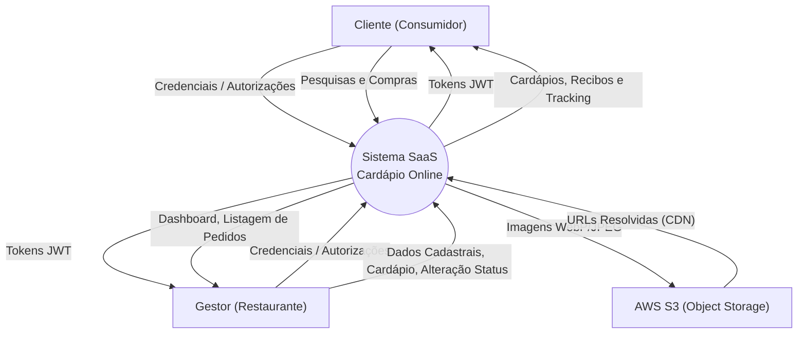
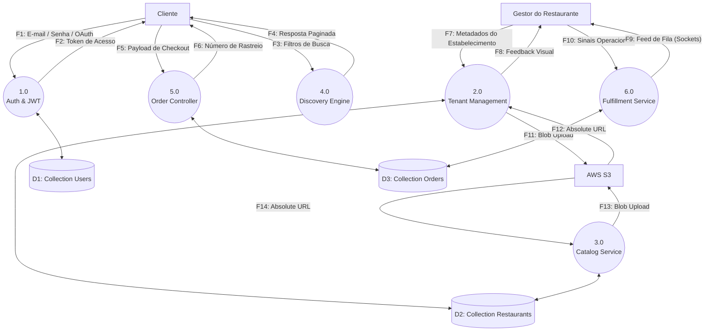

# 4. Diagramas de Fluxo de Dados (DFD)

A modelagem de Fluxo de Dados mapeia as fronteiras do sistema, demonstrando como as informações transitam, são processadas e armazenadas dentro da arquitetura do Cardápio Online.

---

## Sumário

- [4.1 DFD Nível 0 — Diagrama de Contexto](#41-dfd-nível-0--diagrama-de-contexto)
- [4.2 DFD Nível 1 — Decomposição de Processos](#42-dfd-nível-1--decomposição-de-processos)

---

## 4.1 DFD Nível 0 — Diagrama de Contexto

O diagrama de contexto (Nível 0) apresenta a visão arquitetural de mais alto nível, tratando todo o software como um nó único em comunicação direta com agentes externos que nutrem ou consomem dados do ecossistema.

### Entidades Externas Mapeadas

| Entidade | Natureza | Papel na Arquitetura |
| --- | --- | --- |
| **Cliente** | Usuário Humano | Consome endpoints públicos, envia solicitações de autenticação e processa intenções de compra transacionais. |
| **Gestor do Restaurante** | Usuário Humano | Manipula a base de metadados dos tenants e orquestra transições logísticas dos pedidos. |
| **AWS S3 / Storage** | Serviço Cloud Expresso | Provedor passivo que recebe blobs binários e expõe URLs de *Edge Caching*. |

---

## 4.2 DFD Nível 1 — Decomposição de Processos

O Nível 1 desestrutura a topologia monolítica do Nível 0 e apresenta como a lógica de serviço do back-end roteia as informações pelos diferentes domínios e coleções do MongoDB.

### Detalhamento dos Processos de Software

| Processo Interno | Domínio | Escopo e Responsabilidade Principal |
| --- | --- | --- |
| **1.0 Auth & JWT** | Autenticação | Gerencia a criação do perfil, delegação para Google OAuth, *hashing* seguro (bcrypt) e emissão temporal do JWT. |
| **2.0 Tenant Management** | Administrativo | Fornece os *endpoints* e *services* para a curadoria técnica dos restaurantes, incluindo *upload* do S3 de logos e banners. |
| **3.0 Catalog Service** | Inventário | Mantém a sanidade de dados dos produtos (Embedding no *Mongo*), categorização e formatação financeira. |
| **4.0 Discovery Engine** | Consulta | Motor de *read-only* que varre a coleção otimizada de restaurantes com paginação e processa filtros de pesquisa. |
| **5.0 Order Controller** | Checkout | Recebe o *Payload* de compra, executa snapshot das matrizes de custo financeiro e grava no Banco de Dados. |
| **6.0 Fulfillment Service** | Operacional | Controla as transições da máquina de estado do pedido, publicando o histórico contábil e orquestrando o WebSocket. |

### Detalhamento dos Data Stores (NoSQL)

| Instância | Ref. MongoDB | Arquitetura |
| --- | --- | --- |
| **D1** | `users` | Coleção central de identidades com índices únicos para `email` e *sparse index* para `google_id`. |
| **D2** | `restaurants` | Coleção densa focada em leituras, com produtos alocados via estratégia *Embedded Document Pattern*. |
| **D3** | `orders` | Coleção transacional auditável. Possui registros fixos (sem relação em cascata para produtos após o processamento da compra). |
