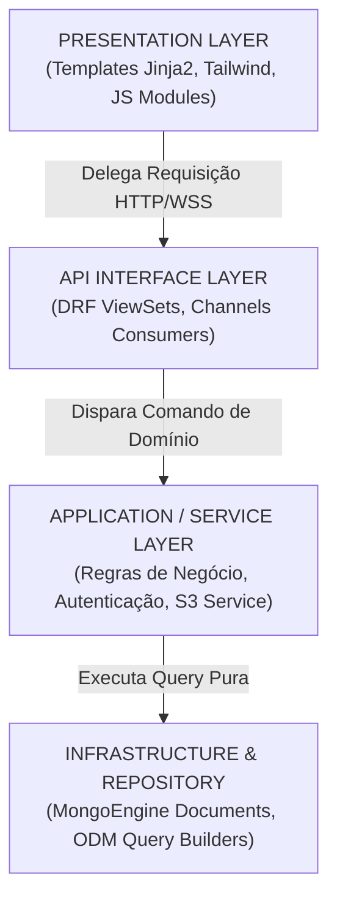
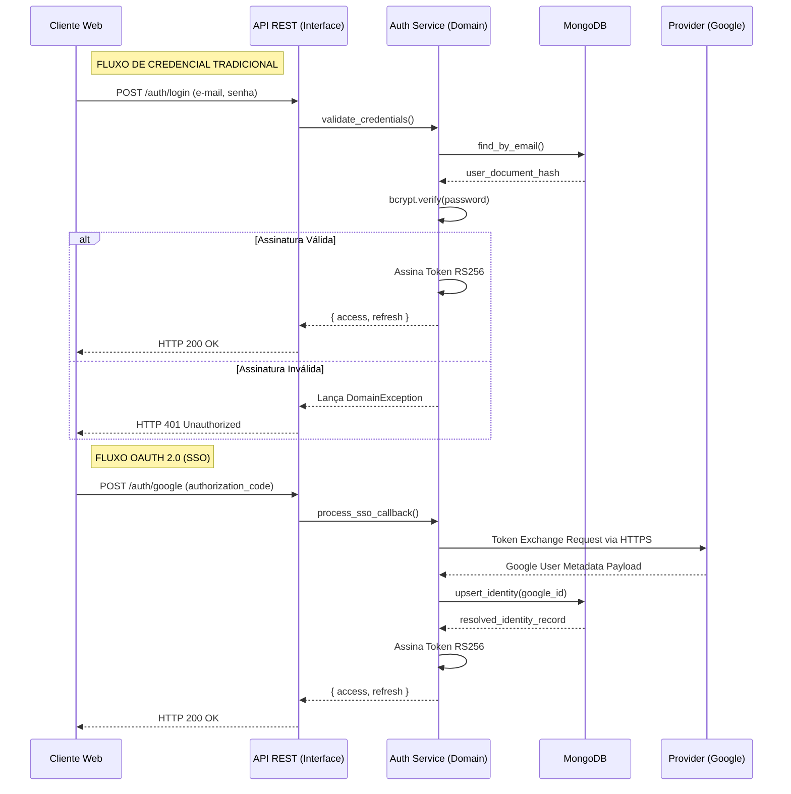

# 5. Arquitetura do Sistema

Este documento descreve as decisões arquiteturais fundamentais, os padrões de engenharia de software implementados e a pilha tecnológica que compõe a espinha dorsal do ecossistema do Cardápio Online.

---

## Sumário

- [5.1 Visão Geral](#51-visão-geral)
- [5.2 Stack Tecnológico Base](#52-stack-tecnológico-base)
- [5.3 Arquitetura em Camadas (Clean Architecture)](#53-arquitetura-em-camadas-clean-architecture)
- [5.4 Mapeamento de Topologia (Diretórios)](#54-mapeamento-de-topologia-diretórios)
- [5.5 API RESTful — Contratos de Interface](#55-api-restful--contratos-de-interface)
- [5.6 Diagrama do Motor de Autenticação](#56-diagrama-do-motor-de-autenticação)

---

## 5.1 Visão Geral

O sistema baseia-se em um modelo estrutural do tipo "Monolito Modular". Embora construído em uma única base de código (single repo), o *domain-driven design* rege a segregação entre recursos, isolando lógica de negócio de roteamento, serialização e visualização. A topologia foi projetada visando facilitar eventual *strangler pattern* (transição para microserviços), caso a escala da plataforma demande abstrações avançadas no futuro.

---

## 5.2 Stack Tecnológico Base

| Camada Estrutural | Ferramenta / Linguagem | Versão Base | Fundamentação Estratégica |
| --- | --- | --- | --- |
| **Linguagem Core** | Python | 3.12+ | Eficiência sintática, vasta biblioteca padrão e suporte avançado a *Typing* (tipagem progressiva). |
| **Application Framework** | Django | 5.0+ | Alta produtividade por configuração por convenção, com robusto ORM agnóstico e camada segura de middlewares. |
| **API Interface Layer** | Django REST Framework (DRF) | 3.15+ | Abstração sólida para rotas estritas, classes ViewSets, *throttling* nativo e suporte serialização relacional/não-relacional. |
| **Infraestrutura Real-time** | Django Channels | 4.x | Integração nativa de WebSocket compatível com as sessões ativas do protocolo HTTP tradicional do framework. |
| **Persistence (Database)** | MongoDB Atlas | 7.x | Capacidade de absorção elástica de tráfego (Schema-less), clusterização nativa e performance de leitura via *Embedding*. |
| **Object Data Mapper** | MongoEngine / Djongo | — | Motor de mapeamento abstraindo os comandos nativos de coleção do Mongo em instâncias de classes limpas. |
| **Object Storage Cloud** | Amazon S3 | — | Persistência distribuída imutável de ativos estáticos de alta volumetria (imagens de lojas e produtos). |
| **Interface Visual (UI)** | Tailwind CSS | 3.x | Implementação de folha de estilos *Utility-First*, reduzindo inflação visual e gerando consistência de componentização. |
| **Engine Criptográfica** | PyJWT | 2.x | Resolução de sessões através de payload assinado digitalmente, reduzindo carga (Stateless) em bancos de dados relacionais de sessão. |

---

## 5.3 Arquitetura em Camadas (Clean Architecture)

A divisão lógica impõe a regra de dependência voltada unicamente para as camadas subjacentes. As requisições externas não têm poder direto sobre o ORM.



---

## 5.4 Mapeamento de Topologia (Diretórios)

```text
cardapio-online/
├── app/
│   ├── settings/
│   │   ├── base.py                 # Core configurations agnósticas a ambiente
│   │   ├── development.py          # Environment settings (Debug=True, SQLite fallback)
│   │   └── production.py           # Segredos produtivos (Debug=False, S3 Bucket)
│   ├── urls.py                     # Root routing mapping
│   └── wsgi.py / asgi.py           # Entrypoints de runtime HTTP e WebSocket
├── apps/                           # Módulos encapsulados da arquitetura lógica
│   ├── authentication/
│   │   ├── serializers.py          # Data validation contracts
│   │   ├── services.py             # Lógica de negócio de identificação
│   │   ├── views.py                # Endpoints (Endpoints / Controllers)
│   │   └── urls.py
│   ├── core/
│   │   ├── middleware.py           # Interceptadores de Requisição e Resposta
│   │   ├── permissions.py          # RBAC (Role-Based Access Control)
│   │   └── exceptions.py           # Hierarquia global de falhas transacionais
│   ├── orders/                     # Lógica transacional e WebSocket (consumers.py)
│   └── restaurants/                # Tenancy model, produtos e menus
├── static/                         # Assets processados de client-side (CSS, Vanilla JS)
├── templates/                      # Views processadas via Server Side Rendering (SSR)
├── docs/                           # Documentação central do ecossistema
└── requirements.txt                # Bloqueio das assinaturas das bibliotecas externas
```

---

## 5.5 API RESTful — Contratos de Interface

### Módulo de Identidade (`/api/auth`)

| Verbo | Rota Principal | Funcionalidade Resolvida |
| --- | --- | --- |
| `POST` | `/api/auth/register/` | Geração de cadastro híbrido (Customer ou Owner). |
| `POST` | `/api/auth/login/` | Autenticação padrão resultando em Access/Refresh Tokens. |
| `POST` | `/api/auth/google/` | Recebe callback OAuth 2.0 e converte em JWT nativo. |
| `POST` | `/api/auth/refresh/` | Realiza a rotação segura do Access Token (Stateless). |

### Módulo de Locatários (`/api/restaurants`)

| Verbo | Rota Principal | Funcionalidade Resolvida |
| --- | --- | --- |
| `GET` | `/api/restaurants/` | Devolve lista pública paginada e sanitizada. |
| `GET` | `/api/restaurants/:id/` | Devolve metadados densos de um restaurante + catálogo. |
| `POST` | `/api/restaurants/` | Provisiona nova identidade jurídica na plataforma. |
| `PUT` | `/api/restaurants/:id/` | Executa override completo nas propriedades do Tenant. |

### Módulo Logístico e Transacional (`/api/orders`)

| Verbo | Rota Principal | Funcionalidade Resolvida |
| --- | --- | --- |
| `POST` | `/api/orders/` | Finalização de checkout com emissão de WebSockets. |
| `GET` | `/api/orders/` | Reconcilia o histórico de compras do usuário ativo. |
| `PATCH` | `/api/orders/:id/status/` | Mutação de trâmite de ordem (Apenas Owner verificado). |

---

## 5.6 Diagrama do Motor de Autenticação

A representação linear abaixo ilustra as defesas e delegações implementadas tanto para a autorização tradicional nativa (E-mail e Senha) quanto para Autenticação Delegada Corporativa (OAuth do Google).


