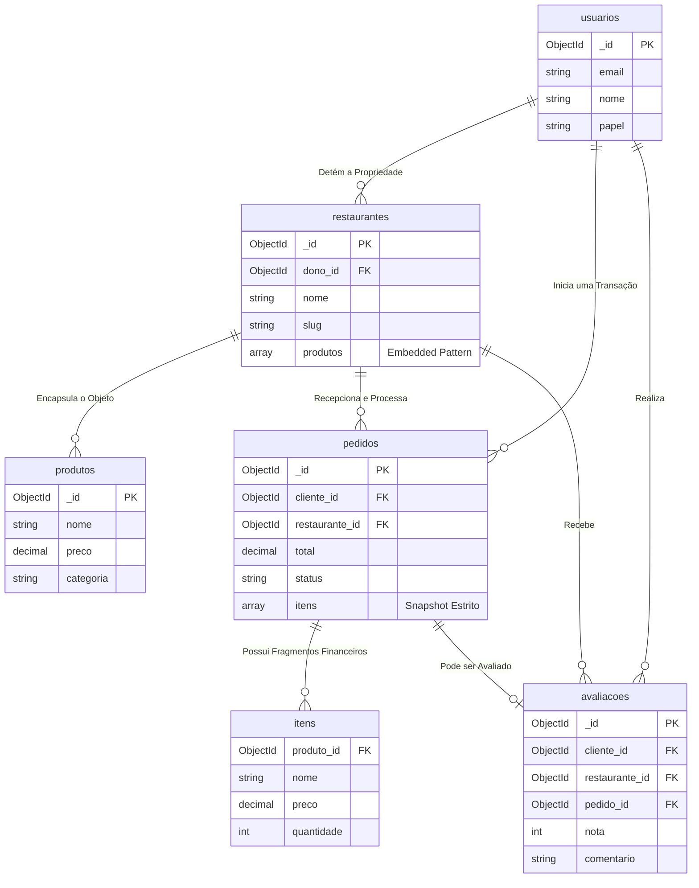

# 6. Modelagem de Dados (MongoDB)

Este documento especifica o design da base de dados não-relacional do Cardápio Online. O esquema prioriza alta performance de leitura (Read-Heavy Operations) típica de sistemas de e-commerce e delivery.

---

## Sumário

- [6.1 Estratégia Estrutural](#61-estratégia-estrutural)
- [6.2 Coleção de Identidades: `usuarios`](#62-coleção-de-identidades-usuarios)
- [6.3 Coleção de Tenants: `restaurantes`](#63-coleção-de-tenants-restaurantes)
- [6.4 Coleção Transacional: `pedidos`](#64-coleção-transacional-pedidos)
- [6.5 Coleção de Avaliações: `avaliacoes`](#65-coleção-de-avaliações-avaliacoes)
- [6.6 Mapa de Entidade-Relacionamento (ERD)](#66-mapa-de-entidade-relacionamento-erd)
- [6.7 Validação de Schema Nativa](#67-validação-de-schema-nativa)

---

## 6.1 Estratégia Estrutural

A modelagem de dados foi arquitetada combinando os padrões estritos de bancos NoSQL voltados para escalabilidade horizontal:
* **Embedded Document Pattern:** Produtos são embutidos diretamente nos restaurantes, visto que raramente são acessados de maneira isolada de seu tenant e o limite de array não excede a restrição de 16MB de um documento BSON.
* **Extended Reference Pattern:** Pedidos referenciam os usuários, mas executam "snapshots" pontuais dos preços e nomes dos produtos. Isso impede a alteração retrospectiva de uma nota fiscal se um dono de restaurante alterar o preço de um hambúrguer no futuro.

---

## 6.2 Coleção de Identidades: `usuarios`

A coleção de *usuarios* age como a matriz global de acesso, agrupando clientes finais e gestores na mesma estrutura lógica mediante isolamento por flag de escopo (`papel`).

```json
{
  "_id": "ObjectId()",
  "email": "string (Indexado, Unique)",
  "senha_hash": "string | null",
  "nome": "string",
  "telefone": "string | null",
  "papel": "string (enum: 'cliente', 'dono')",
  "avatar_url": "string | null (URL Absoluta AWS S3)",
  "google_id": "string | null (Indexado Sparse, Unique)",
  "enderecos": [
    {
      "rotulo": "string (ex: Residência)",
      "rua": "string",
      "numero": "string",
      "complemento": "string | null",
      "bairro": "string",
      "cidade": "string",
      "estado": "string",
      "cep": "string",
      "padrao": "boolean"
    }
  ],
  "esta_ativo": "boolean",
  "criado_em": "ISODate()",
  "atualizado_em": "ISODate()"
}
```

### Índices de Performance (`usuarios`)
```javascript
db.usuarios.createIndex({ "email": 1 }, { unique: true })
db.usuarios.createIndex({ "google_id": 1 }, { unique: true, sparse: true })
db.usuarios.createIndex({ "papel": 1 })
```

---

## 6.3 Coleção de Tenants: `restaurantes`

A coleção `restaurantes` é a estrutura de maior densidade no sistema. Ao englobar a grade de *horarios_funcionamento* e os *produtos*, ela permite a renderização completa de uma página de restaurante sem a necessidade de gerar sub-consultas (*JOIN/Lookup*).

```json
{
  "_id": "ObjectId()",
  "dono_id": "ObjectId() (Ref: usuarios)",
  "nome": "string",
  "slug": "string (Indexado, Unique)",
  "descricao": "string",
  "imagem_capa_url": "string",
  "logo_url": "string | null",
  "contato": {
    "telefone": "string",
    "email": "string | null",
    "whatsapp": "string | null"
  },
  "endereco": {
    "rua": "string",
    "numero": "string",
    "bairro": "string",
    "cidade": "string",
    "estado": "string",
    "cep": "string",
    "coordenadas": {
      "lat": "number",
      "lng": "number"
    }
  },
  "horarios_funcionamento": [
    {
      "dia": "integer (0=Domingo, 6=Sábado)",
      "abertura": "string (Formato HH:MM)",
      "fechamento": "string (Formato HH:MM)",
      "fechado": "boolean"
    }
  ],
  "categorias": ["string"],
  "produtos": [
    {
      "_id": "ObjectId()",
      "nome": "string",
      "descricao": "string",
      "preco": "number (Decimal128)",
      "categoria": "string (enum)",
      "imagem_url": "string",
      "esta_disponivel": "boolean",
      "ordem": "integer",
      "criado_em": "ISODate()",
      "atualizado_em": "ISODate()"
    }
  ],
  "status": "string (enum: 'ativo', 'inativo', 'suspenso')",
  "avaliacao": {
    "media": "number (escala 0-5)",
    "contagem": "integer"
  },
  "criado_em": "ISODate()",
  "atualizado_em": "ISODate()"
}
```

### Índices de Performance (`restaurantes`)
```javascript
db.restaurantes.createIndex({ "slug": 1 }, { unique: true })
db.restaurantes.createIndex({ "dono_id": 1 })
db.restaurantes.createIndex({ "status": 1 })
db.restaurantes.createIndex({ "nome": "text", "descricao": "text" })
db.restaurantes.createIndex({ "endereco.coordenadas": "2dsphere" })
db.restaurantes.createIndex({ "produtos.categoria": 1 })
```

---

## 6.4 Coleção Transacional: `pedidos`

Documentos de ordem de serviço são estruturas imutáveis que operam como registros contábeis, armazenando em suas matrizes o valor monetário real acordado no ato do checkout.

```json
{
  "_id": "ObjectId()",
  "numero_pedido": "string (Unique, Prefixo: ORD-2026-X)",
  "cliente_id": "ObjectId() (Ref: usuarios)",
  "restaurante_id": "ObjectId() (Ref: restaurantes)",
  "itens": [
    {
      "produto_id": "ObjectId()",
      "nome": "string (Snapshot Congelado)",
      "preco": "number (Decimal128)",
      "quantidade": "integer",
      "subtotal": "number (Decimal128)",
      "imagem_url": "string"
    }
  ],
  "total": "number (Decimal128)",
  "status": "string (enum: 'pendente', 'confirmado', 'preparando', 'pronto', 'entregue', 'cancelado')",
  "historico_status": [
    {
      "status": "string",
      "alterado_em": "ISODate()",
      "alterado_por": "ObjectId() (Ref: usuarios)"
    }
  ],
  "metodo_entrega": "string (enum: 'entrega', 'retirada')",
  "endereco_entrega": {
    "rua": "string",
    "numero": "string",
    "bairro": "string",
    "cidade": "string",
    "estado": "string",
    "cep": "string"
  },
  "observacoes": "string | null",
  "criado_em": "ISODate()",
  "atualizado_em": "ISODate()"
}
```

### Índices de Performance (`pedidos`)
```javascript
db.pedidos.createIndex({ "numero_pedido": 1 }, { unique: true })
db.pedidos.createIndex({ "cliente_id": 1, "criado_em": -1 })
db.pedidos.createIndex({ "restaurante_id": 1, "status": 1, "criado_em": -1 })
```

---

## 6.5 Coleção de Avaliações: `avaliacoes`

A coleção de *avaliacoes* permite o registro do feedback dos clientes após a conclusão de um pedido. Esta coleção armazena os dados em português, referenciando o restaurante e opcionalmente o pedido.

```json
{
  "_id": "ObjectId()",
  "cliente_id": "ObjectId() (Ref: usuarios)",
  "nome_cliente": "string",
  "restaurante_id": "ObjectId() (Ref: restaurantes)",
  "pedido_id": "ObjectId() | null (Ref: pedidos)",
  "nota": "integer (1-5)",
  "comentario": "string | null",
  "criado_em": "ISODate()"
}
```

### Índices de Performance (`avaliacoes`)
```javascript
db.avaliacoes.createIndex({ "restaurante_id": 1, "criado_em": -1 })
db.avaliacoes.createIndex({ "cliente_id": 1 })
db.avaliacoes.createIndex({ "pedido_id": 1 }, { sparse: true })
```

---

## 6.6 Mapa de Entidade-Relacionamento (ERD)

A abstração abaixo mapeia como o banco NoSQL implementa o conceito de ligação através das abordagens híbridas de Foreign Keys lógicas e Embedded Objects.



---

## 6.7 Validação de Schema Nativa

Apesar do design Schema-less do MongoDB, proteções contra a gravação de dados falhos são aplicadas no *Driver* através do *JSON Schema Validator* atrelado às coleções core.

```javascript
db.createCollection("pedidos", {
  validator: {
    $jsonSchema: {
      bsonType: "object",
      required: ["numero_pedido", "cliente_id", "restaurante_id", "itens", "total", "status"],
      properties: {
        status: { 
          enum: ["pendente", "confirmado", "preparando", "pronto", "entregue", "cancelado"],
          description: "A violação do fluxo transacional reverte a inserção."
        },
        total: { 
          bsonType: "decimal", 
          minimum: 0,
          description: "A totalização não pode sofrer inconsistência negativa."
        },
        itens: {
          bsonType: "array",
          minItems: 1,
          items: {
            bsonType: "object",
            required: ["produto_id", "nome", "preco", "quantidade", "subtotal"]
          }
        }
      }
    }
  }
})
```
