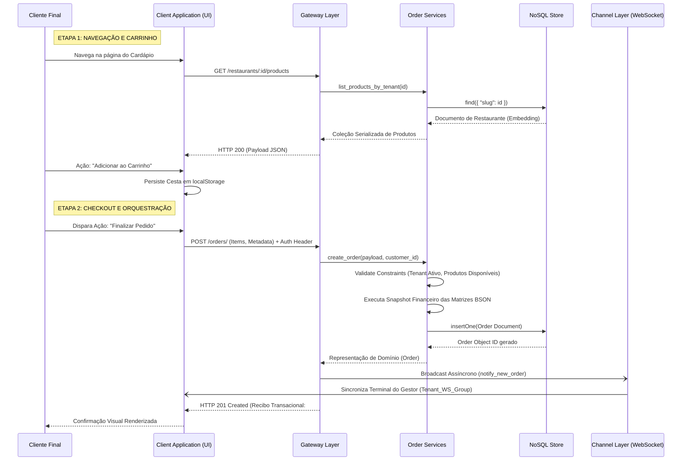
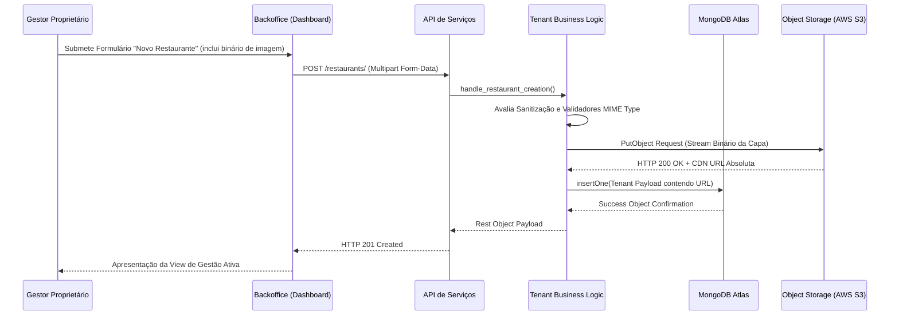
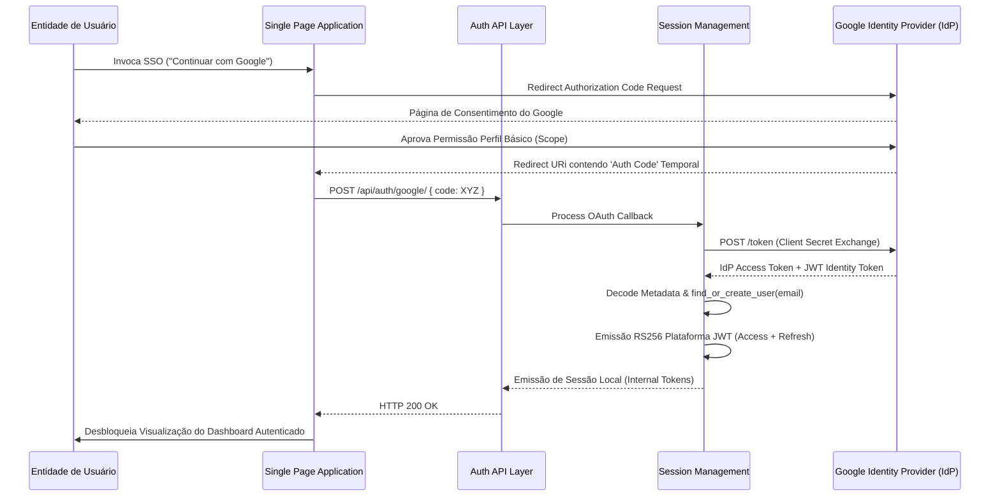
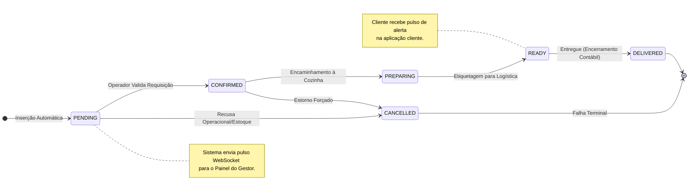

# 7. Modelagem Dinâmica: Diagramas de Sequência

Este documento ilustra a dinâmica comportamental do sistema, expondo a comunicação entre camadas através de fluxos operacionais mapeados no tempo.

---

## Sumário

- [7.1 Fluxo Completo de Transação Comercial (Pedido)](#71-fluxo-completo-de-transação-comercial-pedido)
- [7.2 Fluxo Arquitetural de Provisionamento e *Upload*](#72-fluxo-arquitetural-de-provisionamento-e-upload)
- [7.3 Orquestração de Identidade Distribuída (OAuth 2.0)](#73-orquestração-de-identidade-distribuída-oauth-20)
- [7.4 Máquina de Estados (State Machine) Logística](#74-máquina-de-estados-state-machine-logística)

---

## 7.1 Fluxo Completo de Transação Comercial (Pedido)

O diagrama de sequência a seguir mapeia a interação desde o consumo passivo do cardápio pelo cliente, passando pela criação da cesta virtual, até o comissionamento do pedido para o terminal em tempo real do restaurante.

---

## 7.2 Fluxo Arquitetural de Provisionamento e *Upload*

O fluxo administrativo descreve a sequência exigida para a criação do ambiente virtual de um locatário, lidando explicitamente com a complexidade transacional de anexos e armazenamento *Out-of-Band* (Amazon S3).

---

## 7.3 Orquestração de Identidade Distribuída (OAuth 2.0)

A delegação da confiabilidade de acesso utiliza as diretrizes do protocolo *Authorization Code Flow* integrado aos microsserviços do Google Accounts.

---

## 7.4 Máquina de Estados (State Machine) Logística

A evolução sequencial de um pedido reflete processos estritamente lineares. Retrocessos de transição não são suportados nativamente (exceto mediante falhas forçadas - cancelamento). O diagrama a seguir representa as fronteiras dessa transição de estado.

### Regras de Transição de Contrato
| Mutação de Estado | Ator Executor | Efeito Colateral na Arquitetura |
| --- | --- | --- |
| `[INIT]` → `pending` | API Node | Pedido é registrado no DB, submetendo o pulso inicial ao nó MQTT/WebSocket do Tenant. |
| `pending` → `confirmed` | Gestor (Owner) | Validação afirmativa enviada via WS para a interface do cliente de forma assíncrona. |
| `confirmed` → `preparing` | Gestor (Owner) | Atualização visual transmitida à SPA (Single Page Application) do cliente. |
| `preparing` → `ready` | Gestor (Owner) | Liberação para coleta; Alerta emitido para o Cliente de *pickup* iminente. |
| `ready` → `delivered` | Gestor (Owner) | *Soft-lock* (Congelamento) do pedido, transição para o Histórico Arquivado no DB. |
| `[QUALQUER]` → `cancelled` | Híbrido | Modificador Excepcional. Exige preenchimento de justificativa obrigatória e anula garantias financeiras. |
