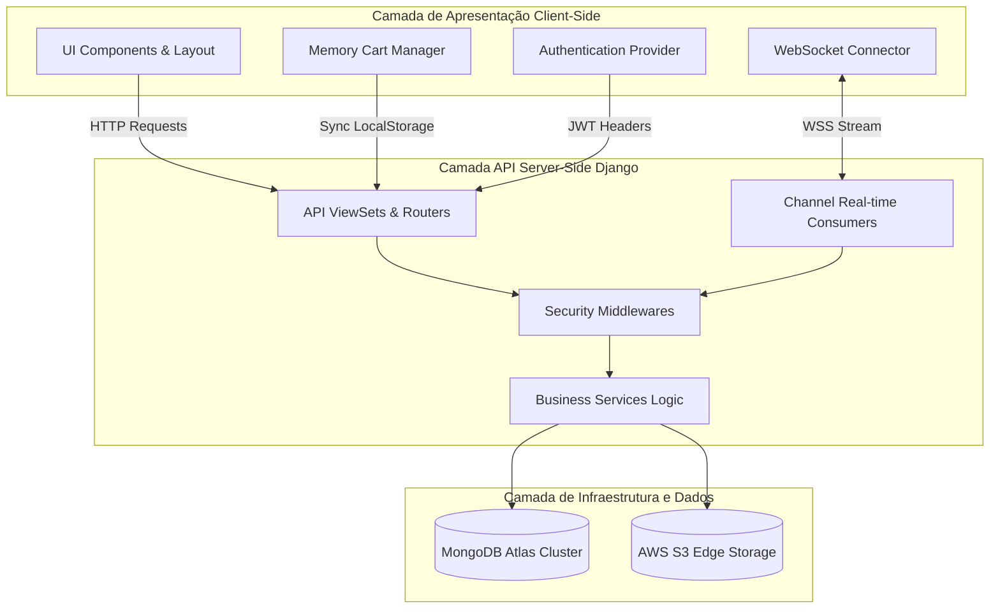
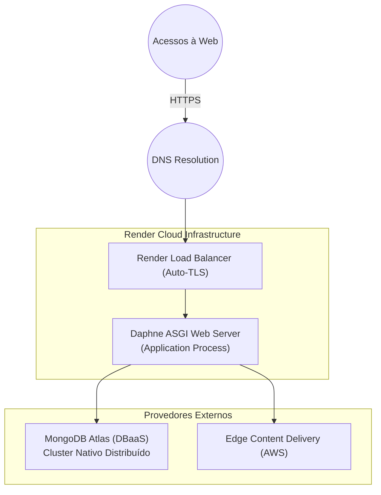

# 8. Componentização e Infraestrutura Lógica

Este documento mapeia a distribuição funcional dos componentes de software, suas fronteiras de responsabilidade, a tipologia de seus módulos front-end/back-end e a topologia de implantação do sistema (Deployment).

---

## Sumário

- [8.1 Visão Geral do Sistema Distribuído](#81-visão-geral-do-sistema-distribuído)
- [8.2 Encapsulamento de Interface (Front-end)](#82-encapsulamento-de-interface-front-end)
- [8.3 Arquitetura de Serviços (Back-end)](#83-arquitetura-de-serviços-back-end)
- [8.4 Padrão de Implantação e Infraestrutura](#84-padrão-de-implantação-e-infraestrutura)

---

## 8.1 Visão Geral do Sistema Distribuído

A organização isola a orquestração de interfaces do usuário das capacidades analíticas de dados via contratos estritos HTTP (REST) e protocolos orientados a eventos (WebSockets).

---

## 8.2 Encapsulamento de Interface (Front-end)

A camada de exibição adota a filosofia *Server-Side Rendering* (SSR) mesclada à componentização moderna via *Vanilla JS* e *Tailwind CSS*.

| Componente Modular | Resumo de Atribuição | Pilha de Ferramentas |
| --- | --- | --- |
| **Componentes UI Base** | Renderização responsiva, consistência visual, estados iterativos e micro-interações. | HTML5 + Tailwind CSS (CDN) |
| **Templates Engine** | Roteamento *Server-Side*, injeção dinâmica de blocos de HTML e estruturação fundamental das páginas. | Django Jinja2 Templates |
| **Cart Manager Module** | Resolução do estado transitório do carrinho e gerenciamento de concorrência com persistência em cache. | JavaScript (API *localStorage*) |
| **Real-time Dispatcher** | Manutenção da esteira de escuta de pulsos operacionais para atualizações iminentes de Interface sem recarregamento. | JavaScript (WebSocket nativo) |
| **Auth API Interceptor** | Manutenção paralela de integridade de tokens (Injeção de Headers e processo orgânico de *refresh* rotativo). | JavaScript (Fetch API + Promise Mappers) |

---

## 8.3 Arquitetura de Serviços (Back-end)

A camada lógica encapsula todo o domínio e processos transacionais através da filosofia do Padrão "Repository e Services".

| Classe Lógica | Responsabilidade de Domínio |
| --- | --- |
| **Authentication Service** | Execução de Hashing, Verificação de Oauth Callback e construção dos claims do JWT. |
| **Restaurant & Catalog Service** | Resolução de Regras de Negócio (Status de Tenants) e gerência do inventário base (Categorização). |
| **Order Transactional Service** | Lógica central da aplicação. Assina os congelamentos financeiros, processa regras de fluxo de Checkout e orquestra WebSockets. |
| **Storage Gateway Service** | Trâmite blindado de uploads. Processa Sanitização MIME Type e *handshakes* com nuvens provedoras de mídia (AWS/Cloudinary). |
| **CORS & JWT Middlewares** | Escudo de borda contra acessos indesejados, protegendo a topologia por injeção e revogação de chaves ativas nas requisições. |
| **Real-time Handlers (Consumers)** | Despachantes assíncronos que mantêm "quartos" de audiência isolados permitindo broadcasting focado aos tenants envolvidos na transação. |

---

## 8.4 Padrão de Implantação e Infraestrutura

A topologia em formato PaaS (Platform as a Service) elimina as custas sistêmicas inerentes ao processamento via containers gerenciados e simplifica as abordagens baseadas em instâncias cruas, transferindo complexidades para provedores elásticos (Render).

### Configurações Ativas do Ambiente Computacional

| Categoria | Definição Produtiva de Deploy |
| --- | --- |
| **Interface de Processo (App Server)** | Executável `daphne` configurado no modo *Binding* (`0.0.0.0`) na porta alocada pelo PaaS de forma dinâmica. |
| **Armazenamento Estático (Edge CDN)** | *Bucket* provisionado visando diminuição severa de *latency* nas apresentações de conteúdo rico. |
| **Clusters Distribuídos de Bando de Dados** | MongoDB (Free Tier M0) distribuído, operando sob credenciais rígidas e com tolerância à falhas geográfica mínima em sub-redes (Multi-AZ). |
