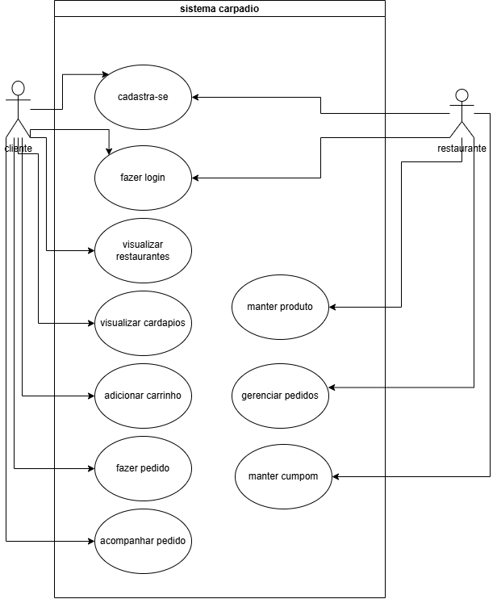

# 3. Casos de Uso

Esta seção descreve as principais interações entre os usuários e o sistema Cardápio Online.

## Diagrama de Casos de Uso

## 3.1 Atores

* **Cliente:** usuário que consulta os cardápios e realiza pedidos.
* **Administrador do Restaurante:** responsável pelo gerenciamento dos produtos, cupons e pedidos do restaurante.

---

## 3.2 Casos de Uso

### UC01 – Cadastrar-se

**Atores:** Cliente e Administrador do Restaurante

**Descrição:** Permite que novos usuários realizem seu cadastro no sistema.

**Fluxo Principal:**

1. O usuário acessa a tela de cadastro.
2. Informa seus dados.
3. O sistema valida as informações.
4. O cadastro é realizado com sucesso.

**Fluxo Alternativo:**

* Caso os dados estejam incorretos ou o e-mail já esteja cadastrado, o sistema informa o erro.

---

### UC02 – Fazer Login

**Atores:** Cliente e Administrador do Restaurante

**Descrição:** Permite que usuários cadastrados acessem o sistema.

**Fluxo Principal:**

1. O usuário informa e-mail e senha.
2. O sistema verifica os dados.
3. O acesso é liberado.

**Fluxo Alternativo:**

* Caso os dados estejam incorretos, o sistema informa que o login não foi realizado.

---

### UC03 – Visualizar Restaurantes

**Ator:** Cliente

**Descrição:** Permite consultar os restaurantes disponíveis.

**Fluxo Principal:**

1. O cliente acessa a página inicial.
2. O sistema exibe a lista de restaurantes.
3. O cliente escolhe um restaurante para visualizar.

---

### UC04 – Visualizar Cardápios

**Ator:** Cliente

**Descrição:** Permite consultar os produtos oferecidos por um restaurante.

**Fluxo Principal:**

1. O cliente seleciona um restaurante.
2. O sistema apresenta os produtos disponíveis.
3. O cliente visualiza as informações dos itens.

---

### UC05 – Adicionar ao Carrinho

**Ator:** Cliente

**Descrição:** Permite adicionar produtos ao carrinho de compras.

**Fluxo Principal:**

1. O cliente escolhe um produto.
2. Define a quantidade desejada.
3. O produto é adicionado ao carrinho.

---

### UC06 – Fazer Pedido

**Ator:** Cliente

**Descrição:** Permite finalizar a compra dos itens adicionados ao carrinho.

**Fluxo Principal:**

1. O cliente acessa o carrinho.
2. Confirma os produtos.
3. Escolhe a forma de entrega e pagamento.
4. O pedido é registrado pelo sistema.

---

### UC07 – Acompanhar Pedido

**Ator:** Cliente

**Descrição:** Permite acompanhar o andamento dos pedidos realizados.

**Fluxo Principal:**

1. O cliente acessa seus pedidos.
2. O sistema apresenta o status atual.
3. O cliente acompanha as atualizações até a entrega.

---

### UC08 – Manter Produto

**Ator:** Administrador do Restaurante

**Descrição:** Permite cadastrar, editar e remover produtos do cardápio.

**Fluxo Principal:**

1. O administrador acessa a área de produtos.
2. Realiza a inclusão, alteração ou exclusão de um item.
3. O sistema salva as alterações.

---

### UC09 – Gerenciar Pedidos

**Ator:** Administrador do Restaurante

**Descrição:** Permite visualizar e atualizar os pedidos recebidos.

**Fluxo Principal:**

1. O administrador consulta os pedidos.
2. Seleciona um pedido.
3. Atualiza seu status.
4. O sistema registra a alteração.

---

### UC10 – Manter Cupom

**Ator:** Administrador do Restaurante

**Descrição:** Permite cadastrar, editar e remover cupons de desconto.

**Fluxo Principal:**

1. O administrador acessa a área de cupons.
2. Cadastra ou altera um cupom.
3. Define as regras de utilização.
4. O sistema salva as informações.
