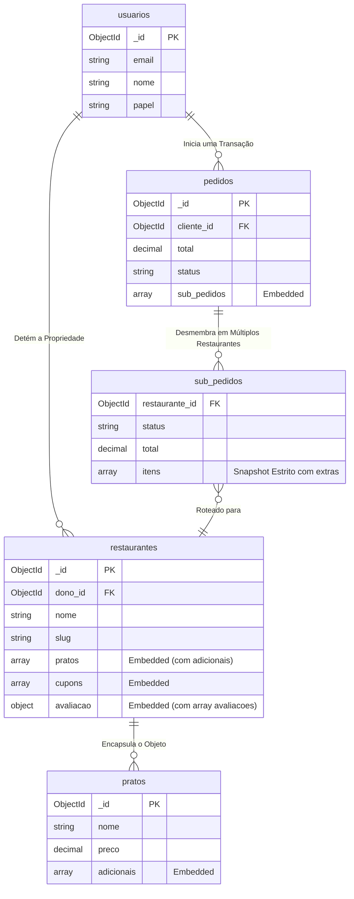

# 6. Modelagem de Dados (MongoDB)

Este documento especifica o design da base de dados não-relacional do Cardápio Online. O esquema prioriza alta performance de leitura (Read-Heavy Operations) típica de sistemas de e-commerce e delivery.

---

## Sumário

- [6.1 Estratégia Estrutural](#61-estratégia-estrutural)
- [6.2 Coleção de Identidades: `usuarios`](#62-coleção-de-identidades-usuarios)
- [6.3 Coleção de Tenants: `restaurantes`](#63-coleção-de-tenants-restaurantes)
- [6.4 Coleção Transacional: `pedidos`](#64-coleção-transacional-pedidos)
- [6.5 Mapa de Entidade-Relacionamento (ERD)](#65-mapa-de-entidade-relacionamento-erd)
- [6.6 Validação de Schema Nativa](#66-validação-de-schema-nativa)

---

## 6.1 Estratégia Estrutural

A modelagem de dados foi arquitetada combinando os padrões estritos de bancos NoSQL voltados para escalabilidade horizontal:
* **Embedded Document Pattern Agressivo:** Produtos, Adicionais, Avaliações de Clientes, Cupons, Horários de Funcionamento e Endereços são embutidos diretamente nos documentos de Restaurantes ou Pedidos. Isso evita sub-consultas (*JOIN/Lookup*) e garante performance extrema na leitura do catálogo.
* **Extended Reference Pattern:** Pedidos referenciam os usuários, mas executam "snapshots" pontuais dos preços e nomes dos produtos, bem como das propriedades do carrinho no ato do fechamento.
* **Multitenancy Isolado por Sub-Pedidos:** Um único `Pedido` consolidado pode agrupar itens de diferentes restaurantes, subdividindo-se em `sub_pedidos` independentes, cada um possuindo seu próprio fluxo de status e taxas (carrinho multi-restaurante).

---

## 6.2 Coleção de Identidades: `usuarios`

A coleção de *usuarios* age como a matriz global de acesso, agrupando clientes finais e gestores na mesma estrutura lógica mediante isolamento por flag de escopo (`papel`).

```json
{
  "_id": "ObjectId()",
  "email": "string (Indexado, Unique)",
  "senha_hash": "string | null",
  "nome": "string",
  "telefone": "string | null",
  "papel": "string (enum: 'cliente', 'dono')",
  "avatar_url": "string | null (URL Absoluta)",
  "google_id": "string | null (Indexado Sparse, Unique)",
  "enderecos": [
    {
      "rotulo": "string (ex: Casa)",
      "rua": "string",
      "numero": "string",
      "complemento": "string | null",
      "bairro": "string",
      "cidade": "string",
      "estado": "string",
      "cep": "string",
      "padrao": "boolean"
    }
  ],
  "esta_ativo": "boolean",
  "tentativas_login_falhas": "integer",
  "bloqueado_ate": "ISODate() | null",
  "criado_em": "ISODate()",
  "atualizado_em": "ISODate()"
}
```

### Índices de Performance (`usuarios`)
```javascript
db.usuarios.createIndex({ "email": 1 }, { unique: true })
db.usuarios.createIndex({ "google_id": 1 }, { unique: true, sparse: true })
db.usuarios.createIndex({ "papel": 1 })
```

---

## 6.3 Coleção de Tenants: `restaurantes`

A coleção `restaurantes` é a estrutura de maior densidade no sistema. Ela engloba a grade de *horarios_funcionamento*, os *pratos* (produtos) com seus *adicionais*, os *cupons* de desconto e a agregação das *avaliações*, permitindo a renderização completa e independente do locatário.

```json
{
  "_id": "ObjectId()",
  "dono_id": "ObjectId() (Ref: usuarios)",
  "nome": "string",
  "slug": "string (Indexado, Unique)",
  "descricao": "string",
  "imagem_capa_url": "string",
  "logo_url": "string | null",
  "contato": {
    "telefone": "string",
    "email": "string | null",
    "whatsapp": "string | null"
  },
  "endereco": {
    "rua": "string",
    "numero": "string",
    "complemento": "string | null",
    "bairro": "string",
    "cidade": "string",
    "estado": "string",
    "cep": "string",
    "coordenadas": {
      "lat": "number",
      "lng": "number"
    }
  },
  "horarios_funcionamento": [
    {
      "dia": "integer (0=Domingo, 6=Sábado)",
      "abertura": "string (Formato HH:MM)",
      "fechamento": "string (Formato HH:MM)",
      "fechado": "boolean"
    }
  ],
  "categorias": ["string"],
  "pratos": [
    {
      "_id": "ObjectId()",
      "nome": "string",
      "descricao": "string",
      "preco": "number (Decimal128)",
      "categoria": "string (enum)",
      "imagem_url": "string",
      "imagens": ["string"],
      "esta_disponivel": "boolean",
      "ordem": "integer",
      "estoque": "integer",
      "ingredientes_principais": "string",
      "adicionais": [
        {
          "nome": "string",
          "preco": "number (Decimal128)"
        }
      ],
      "criado_em": "ISODate()",
      "atualizado_em": "ISODate()"
    }
  ],
  "cupons": [
    {
      "_id": "ObjectId()",
      "codigo": "string",
      "descricao": "string | null",
      "tipo_desconto": "string (enum: 'porcentagem', 'fixo')",
      "valor_desconto": "number (Decimal128)",
      "pedido_minimo": "number (Decimal128)",
      "max_usos": "integer",
      "contagem_usos": "integer",
      "valido_de": "ISODate()",
      "valido_ate": "ISODate() | null",
      "esta_ativo": "boolean"
    }
  ],
  "taxa_entrega": "number (Decimal128)",
  "tempo_entrega_estimado": "string",
  "status": "string (enum: 'ativo', 'inativo', 'suspenso')",
  "avaliacao": {
    "media": "number (escala 0-5)",
    "contagem": "integer",
    "avaliacoes": [
      {
        "_id": "ObjectId()",
        "cliente_id": "ObjectId() (Ref: usuarios)",
        "nome_cliente": "string",
        "restaurante_id": "ObjectId() (Ref: restaurantes)",
        "pedido_id": "ObjectId() | null (Ref: pedidos)",
        "nota": "integer (1-5)",
        "comentario": "string | null",
        "criado_em": "ISODate()"
      }
    ]
  },
  "criado_em": "ISODate()",
  "atualizado_em": "ISODate()"
}
```

### Índices de Performance (`restaurantes`)
```javascript
db.restaurantes.createIndex({ "slug": 1 }, { unique: true })
db.restaurantes.createIndex({ "dono_id": 1 })
db.restaurantes.createIndex({ "status": 1 })
db.restaurantes.createIndex({ "nome": "text", "descricao": "text" }, { default_language: "portuguese" })
db.restaurantes.createIndex({ "produtos.categoria": 1 })
```

---

## 6.4 Coleção Transacional: `pedidos`

Documentos de ordem de serviço suportam compras em múltiplos restaurantes simultaneamente, segmentando os carrinhos em `sub_pedidos` independentes, atuando como registros contábeis imutáveis e protegendo a integridade fiscal.

```json
{
  "_id": "ObjectId()",
  "numero_pedido": "string (Unique)",
  "cliente_id": "ObjectId() (Ref: usuarios)",
  "sub_pedidos": [
    {
      "restaurante_id": "ObjectId() (Ref: restaurantes)",
      "itens": [
        {
          "prato_id": "ObjectId()",
          "nome": "string (Snapshot)",
          "preco": "number (Decimal128)",
          "quantidade": "integer",
          "subtotal": "number (Decimal128)",
          "imagem_url": "string | null",
          "extras": [
            {
              "nome": "string",
              "preco": "number (Decimal128)"
            }
          ]
        }
      ],
      "total": "number (Decimal128)",
      "taxa_entrega": "number (Decimal128)",
      "valor_desconto": "number (Decimal128)",
      "codigo_cupom": "string",
      "status": "string (enum: 'pendente', 'confirmado', 'preparando', 'pronto', 'entregue', 'cancelado')",
      "historico_status": [
        {
          "status": "string",
          "alterado_em": "ISODate()",
          "alterado_por": "ObjectId() | null"
        }
      ]
    }
  ],
  "total": "number (Decimal128) (Soma de todos os sub-pedidos)",
  "taxa_entrega": "number (Decimal128)",
  "valor_desconto": "number (Decimal128)",
  "codigo_cupom": "string",
  "status": "string (Status Macro)",
  "historico_status": ["Embedded Document Array"],
  "metodo_entrega": "string (enum: 'entrega', 'retirada')",
  "endereco_entrega": {
    "rua": "string",
    "numero": "string",
    "complemento": "string",
    "bairro": "string",
    "cidade": "string",
    "estado": "string",
    "cep": "string"
  },
  "metodo_pagamento": "string (enum: 'pix', 'cartao', 'dinheiro')",
  "observacoes": "string | null",
  "criado_em": "ISODate()",
  "atualizado_em": "ISODate()"
}
```

### Índices de Performance (`pedidos`)
```javascript
db.pedidos.createIndex({ "numero_pedido": 1 }, { unique: true })
db.pedidos.createIndex({ "cliente_id": 1, "criado_em": -1 })
db.pedidos.createIndex({ "sub_pedidos.restaurante_id": 1, "sub_pedidos.status": 1, "criado_em": -1 })
db.pedidos.createIndex({ "status": 1 })
db.pedidos.createIndex({ "criado_em": -1 })
```

---

## 6.5 Mapa de Entidade-Relacionamento (ERD)

A abstração abaixo mapeia como o banco NoSQL implementa o conceito de ligação através das abordagens híbridas de Foreign Keys lógicas e Embedded Objects, refletindo o modelo multi-restaurante e os novos embutimentos (Avaliações e Cupons).



---

## 6.6 Validação de Schema Nativa

Apesar do design Schema-less do MongoDB, proteções contra a gravação de dados falhos são aplicadas no *Driver* através do *JSON Schema Validator* atrelado às coleções core.

```javascript
db.createCollection("pedidos", {
  validator: {
    $jsonSchema: {
      bsonType: "object",
      required: ["numero_pedido", "cliente_id", "sub_pedidos", "total", "status", "metodo_entrega", "metodo_pagamento"],
      properties: {
        total: { 
          bsonType: "decimal", 
          minimum: 0,
          description: "A totalização não pode sofrer inconsistência negativa."
        },
        sub_pedidos: {
          bsonType: "array",
          minItems: 1,
          items: {
            bsonType: "object",
            required: ["restaurante_id", "itens", "total", "status"],
            properties: {
              status: {
                enum: ["pendente", "confirmado", "preparando", "pronto", "entregue", "cancelado"]
              },
              itens: {
                bsonType: "array",
                minItems: 1
              }
            }
          }
        }
      }
    }
  }
})
```
