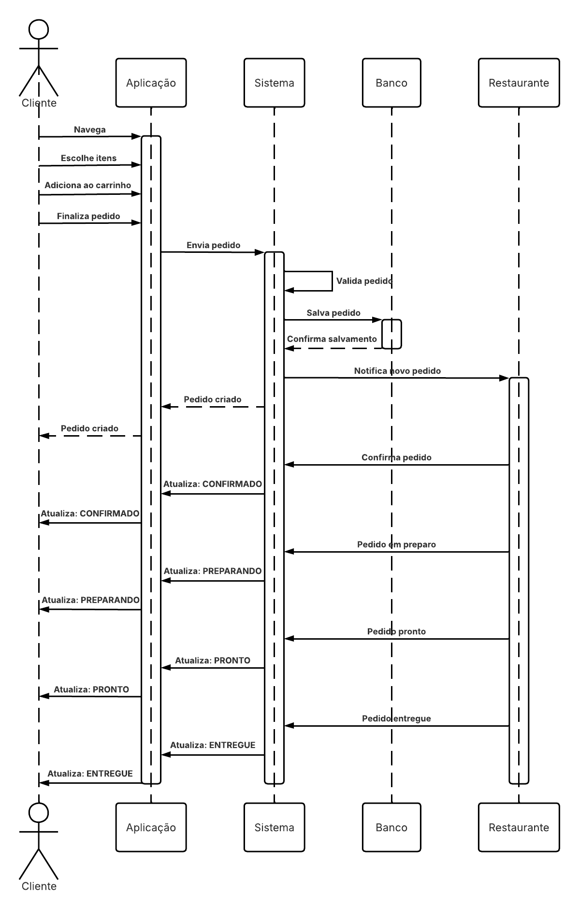

# 7. Modelagem Dinâmica: Diagrama de Sequência

Este documento ilustra a dinâmica comportamental do sistema, expondo a comunicação entre as camadas através de fluxos operacionais mapeados no tempo.

---

## Sumário

- [7.1 Visão Geral do Fluxo](#71-visão-geral-do-fluxo)
- [7.2 Diagrama Visual](#72-diagrama-visual)

---

## 7.1 Visão Geral do Fluxo

O diagrama de sequência mapeia as interações e trocas de mensagens entre as diversas entidades e componentes do sistema durante sua operação, fornecendo uma visão clara de como os processos principais são orquestrados e integrados na arquitetura.

---

## 7.2 Diagrama Visual

A imagem abaixo apresenta a modelagem dinâmica consolidada do sistema.

